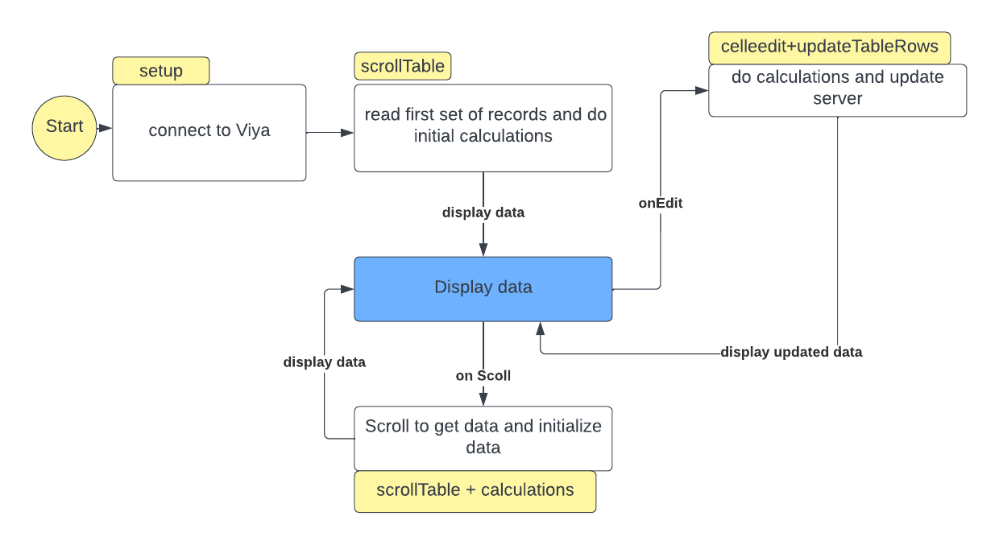

# restafedit - library for browsing and editing CAS tables and SAS Tables

- [Introduction](#intro)
  - [Link to API documentation](https://sassoftware.github.io/restaf)
- [Installation](#install)
- [Basic Flow](#basicflow)
- [Getting Started Example](#example1)
- [Editing with calculations](#example2)
- [First Web Application](#webapp1)
- [React Application](#reactapp1)
- [Additional fields in appControl](#appcontrol)
- [Using appEnv](#appenv)
- [Accessing Viya from the handlers](#handlers)
- [Notes on logonPayload](#logon)

> [Documentation](/docs/index.html)
---

## Introduction<a name="intro"></a>

---

**Latest Version** @sassoftware/restafedit@latest

@sassoftware/restafedit is an unified way to read and write SAS Viya tables (CAS or SAS tables) with just a few lines of code.

Here is an example of scrolling thru a CAS table.

```js
 let appControl = {
    source: 'cas',
    table : { caslib: 'casuser', name: 'testdatatemp' }
 };
 const {
   const payload = {
    host        : <your Viya Server>,
    authType    : 'token',
    token       : <your SAS authorization token>,
    tokenType   : 'bearer'
  }
 }
 
  let appEnv = setup(payload, appControl);
  // get first set of records
  await scrollTable('first', appEnv);
  console.log(JSON.stringify(r.data));

  // read the rest of the table
  while (appEnv.state.scrollOptions.includes('next')) {
    const r = await scrollTable('next', appEnv);
    console.log(JSON.stringify(r.data));
    // do something with the data
  }

```

## Currently Supported Features<a name="t4"></a>

- Creation and management of CAS session or Compute Session
- Reading one or more records from a cas table or SAS table
  - where clause supported
- Update the records based on a key(will update all records with that key)
- Scrolling through the table
- Saving the inmemory cas Table
- Allow users to specify calculations(called handlers in this document)
  - *init* calculations on reading the record
  - *main* calculations on editing a cell
  - *term* calculations before saving the row to server
  - Calculations for each column on editing. *main* is run after this calculation
    - The name of the handler must match the lower-cased name of the column
  - Using this pattern developer can add more handlers
  - Run calculations on the client using JavaScript
  - Handlers can call the server for additional calculations.
    - On the cas server use casl
    - On compute server use SAS programs
- Access to other SAS REST API
  - Recommend using [restaf and restaflib](https://sassoftware.github.io/restaf) for rapid appplication development
  - External destination using http (ex: An Azure App for a SAS Decisioning Flow)

---

## Basic Flow<a name="basicflow"></a>

---

The Table Editor in the picture below is supplied by the user.


### Working Examples

- [Simple Editor Application](https://github.com/sassoftware/restaf-uidemos/tree/editorapp) - Demonstrates the use of this library using basic javascript and html to edit a cas table.

- [React Application Editing](https://github.com/sassoftware/restaf-uidemos/tree/editorappreact) - Demonstrates a react application.

---

## Installation<a name="install"></a>

---

The library can be installed using npm, yarn.
It can also be accessed via script tags in your browser.

### Script Tags

restafedit depends on restaf and restaflib

```html
 <script src="https://unpkg.com/@sassoftware/restaf@next"></script>
 <script src="https://unpkg.com/@sassoftware/restaflib@next"></script>
 <script src="https://unpkg.com/@sassoftware/restafedit@next"></script>

 ```

### nodejs

```sh
npm install @sassoftware/restaf@next @sassoftware/restaflib@next @sassoftware/restafedit@next
```

---

## Writing your first editor<a name="example1"></a>

---

### `Scenario 1`

- read data from a cas table
- modify a row and update the inmemory table
- save the inmemory table
- do more scrolling

Link: <https://github.com/sassoftware/restaf/blob/restafedit/test/example1.js>

#### Review of appControl

The appControl is used to setup and control the flow of the application from a data handling point of view.
Other than the information for connecting to Viya there is no other configuration information needed.

 Comments are inline
 </blockquote>

```js
 description: 'Simple Example',
    // the source is either 'cas' or 'compute'. This defines which server is being accessed in this session
    source: 'cas', 
    
    // Specify the table to be edited. 
    // If the source is cas, then caslib is specified
    // If the source is compute, then change caslib to libref below

    table : { caslib: 'public', name: 'TESTDATA' },
    
    // To update a record, the key column must be specified.
    // If this is not specified, autoSave will be turned off

    byvars: ['id'],

    // This is primarily used to do the initial read
    // If using a table viewer, the limit should be set to some reasonable number
    // A limit of 1 should be used when editing thru a form.
    // If the source is compute then you can use all the options allowed for rowSets API
    // (https://developer.sas.com/apis/rest/Compute/#get-a-row-set-from-a-data-set)
    initialFetch: {
      qs: {
        start : 0,
        limit : 1,
        format: false,
        where : 'x1 GT 5'
      }
    },

    // Specify calculated/custom columns. 
    // It is optional (as in the first example below)
    customColumns: {},

    // User adds their handlers for calculations.
    // All of these are optional.
    // This is discussed in Scenario 2
    editControl: {
      handlers: {}, /* place holder for calculations */
      autoSave: true  /* this is default. On each edit the data on server is updated */
    },
    appData: {} /* place holder for additional user data. In later examples this is used to control the UI */

  };
  ```

```js
const { setup, scrollTable, cellEdit, saveTable } = require('../dist/index.js');

runit()
  .then(r => console.log(r))
  .catch(err => console.log(err));


async function runit () {

  // See https://github.com/sassoftware/restaf/wiki/authentication for
  // more details and other options
  const viyaConnection = {
    host        : process.env.VIYA_SERVER,
    authType    : 'password',
    clientID    : process.env.CLIENTID,
    clientSecret: '',
    user        : '<your userid>',
    password    : '<your password>'
  };

  // For readability moved the appControl definition
  // to the end as a function
  // Also a good practice since it allows runtime creation of appControl
  const appControl = getAppControl();

  // setup edit session
  const appEnv = await setup(viyaConnection, appControl);

  // get the first set of records
  // data is available as appEnv.state.data
  // the column definitions are also available as appEnv.state.columns

  let result = await scrollTable('first', appEnv);
  console.log(result.status);
  console.log(appEnv.state.data);

  // Simulate an edit operation
  // The updated record is also updated on the cas inmemory table
  // Uses the byvars in the appControl as the key for merge

  const x3New = result.data[0].x3 + 100;
  await cellEdit('x3', x3New, 0, result.data[0], appEnv);

  // Confirm it was written to the inmemory table
  // by refetching it
  result = await scrollTable('first', appEnv);
  console.log(appEnv.state.data);

  // Optionally persist the imemory table
  const status = await saveTable(appEnv);
  console.log(status);

  // Continue to scroll (next|prev|first) and do more editing
  result = await scrollTable('next', appEnv);
  // Do some more editing
  result = await scrollTable('prev', appEnv);
  return 'done';
};

function getAppControl () {
  return {
    description: 'Simple Example',

    source: 'cas',
    table : { caslib: 'public', name: 'TESTDATA' },
    byvars: ['id'],

    cachePolicy: true,

    initialFetch: {
      qs: {
        start : 0,
        limit : 1,
        format: false,
        where : 'x1 GT 5'
      }
    },

    customColumns: {},

    editControl: {
      handlers: {}, /* place holder for calculations */
      autoSave: true
    },
    appData: {} /* place holder for additional user data  */

  };
}
```

---

## Editing with calculations<a name="example2"></a>

---

### `Scenario 2`

In a typical edit session user input is checked and some temporary(computed/calcuated) columns are updated.

restafedit allows the developer to do these by specifying the information in the appControl.

- Custom Columns -- Specify your additional columns in the CustomColumns field in appControl. There is no limit to the number of calculated columns

- Calculations -- Specify functions in the editControl.handlers object.

Below is the updated example. The custom column is calculated when a record is read and when a cell is modified in the *init* and *main* handlers(functions).

When the column x1 is modified the handler *x1* followed by *main* are executed.

Before the record is written to the server, the *term* handler is executed.

All of these handlers are optional. If you have computed columns then at a minimum you should specify the *init* and *main* handlers. In many cases you can use the same handler for *init* and *main*.

Link: <https://github.com/sassoftware/restaf/blob/restafedit/test/example2.js>

```js
/* eslint-disable quotes */
const { setup, scrollTable, cellEdit, saveTable } = require('../dist/index.js');

runit()
  .then(r => console.log(r))
  .catch(err => console.log(err));

async function runit () {
  const viyaConnection = {
    host        : process.env.VIYA_SERVER,
    authType    : 'password',
    clientID    : process.env.clientid,
    clientSecret: '',
    user        : 'username',
    password    : 'password'
  };

  // For readability moved the appControl definition
  // to the end as a function
  // Also a good practice since it allows runtime creation of appControl
  const appControl = getAppControl();

  // setup edit session
  const appEnv = await setup(viyaConnection, appControl);

  // get the first set of records
  // data is available as appEnv.state.data
  // the column definitions are also available as appEnv.state.columns

  let result = await scrollTable('first', appEnv);
  console.log(result.status);
  console.log(appEnv.state.data);

  // Simulate an edit operation
  // The updated record is also updated on the cas inmemory table

  const x3New = result.data[0].x3 + 100;
  await cellEdit('x3', x3New, 0, result.data[0], appEnv);

  // Confirm it was written to the inmemory table
  // by refetching it
  result = await scrollTable('first', appEnv);
  console.log(appEnv.state.data);

  // Optionally persist the imemory table
  const status = await saveTable(appEnv);
  console.log(status);

  // Continue to scroll (next|prev|first) and do more editing
  result = await scrollTable('next', appEnv);
  // Do some more editing
  result = await scrollTable('prev', appEnv);
  return 'done';
};

function getAppControl () {
  return {
    description: 'Simple Example',

    source: 'cas',
    table : { caslib: 'public', name: 'TESTDATA' },
    byvars: ['id'],

    cachePolicy: true,

    initialFetch: {
      qs: {
        start : 0,
        limit : 1,
        format: false,
        where : 'x1 GT 5'
      }
    },
    customColumns: {
      total: {
        Column         : 'Total',
        Label          : 'Grand Total',
        FormattedLength: 12,
        Type           : 'double'
      }
    },

    editControl: {
      handlers: { init, main, term, x1 }
    },
    appData: {} /* place holder for additional user data  */

  };
}
async function init (data, rowIndex, appEnv, type) {
  let status = { statusCode: 0, msg: `${type} processing completed` };
  data.total = data.x1 + data.x2 + data.x3;
  debugger;
  return [data, status];
};
async function main (data, rowIndex, appEnv, type) {
  let status = { statusCode: 0, msg: `${type} processing completed` };
  data.total = data.x1 + data.x2 + data.x3;
  debugger;
  return [data, status];
};

async function term (data, rowIndex, appEnv, type) {
  let status = { statusCode: 0, msg: `${type} processing completed` };
  console.log('In term');
  debugger;
  return [data, status];
};

async function x1 (data, name, rowIndex, appEnv) {
  let status = { statusCode: 0, msg: `${name} handler executed.` };
  if (data.x1 > 10) {
    status = { statusCode: 1, msg: `Value of X1 exceeded 10. Set to 10` };
  }
  return [data, status];
};

```

---

## First Web Application<a name="webapp1"></a>

---

### `Scenario 3`

In this scenario, the goal is to create  very simple web application that mimics Scenario 2.
Note that the application code is very similar to Example 2, with the obvious additional coding in the html file for display.
The simple display is shown below. The html for this display is [here](https://github.com/sassoftware/restaf-uidemos/blob/editorapp/public/index.html).


The code to handle the initialization, cellediting and scrolling is the code below. Notice the similarity with the Example 2 Scenario aboe.
The key differences are:

- The authentication(viyaConnection) uses authorization_code flow.
- The initialize function is executed after DOM initialization.

The html

```js

// web app version of Example 2
// Main difference is the initialize function to do the initialization
// when the body is initialized
//
function getAppControl() {
  return {
    description: 'Simple Example',
    source: 'cas',
    table : {caslib: 'public', name: 'TESTDATA'},
    byvars: ['id'],
    initialFetch: {
      qs: {
        start : 0,
        limit : 1,
        format: false,
        where :  ''
      }
    },
    customColumns: {
      total: {
        Column         : "Total",
        Label          : "Grand Total",
        FormattedLength: 12,
        Type           : "double"
        }
    },
    editControl: {
      handlers: {init: init, main: main, term: term, x1: x1},
      autoSave: true, 
  
    },
    appData: {}

  };
};

async function initialize(viyaConnection) {
  // In this example the browser ia authenticated
  // So the viyaConnection has the following schema
  // { host: <viyahostURL, authType: 'code'}
  debugger;
  let appControl = getAppControl();
  let r = await restafedit.setup(viyaConnection, appControl);
  let r2 = await restafedit.scrollTable('first', r);
  return r;
  }
async function init (data,rowIndex,appEnv,type) {
  let status = {code: 0, msg: `${type} processing completed`};
  data.total = data.x1 + data.x2 + data.x3 ;
  return [data, status];
};
async function main (data, rowIndex,appEnv, type) {
let status = {code: 0, msg: `${type} processing completed`};
data.total = data.x1 + data.x2 + data.x3 ;
return [data, status];
};
async function term (data, rowIndex,appEnv, type) {
  let status = {code: 0, msg: `${type} processing completed`};
  return [data, status];
};

async function x1 (data, name, rowIndex, appEnv) {
  let status = {code: 1, msg: `${name} handler executed.`};
  if (data.x1 > 10) {
      data.x1 = 10;
      msg = {code: 0, msg: "Exceeded Max. Value reset to max"};
  }
  return [data, status];
}

```

---

## React Application<a name="reactapp1"></a>

---

### `Scenario 4`

In this scenario the web application in scenario 3 is converted to a react application.
The working example is in this [repository](https://github.com/sassoftware/restaf-uidemos/tree/editorappreact)

<blockquote>
The example uses material-ui as the component library.
The restafedit library is component library agnostic.
</blockquote>

Ignoring the react specific setups, the editing application setup is very similar to the previous scenarios. The appControl is extracted here for convenience.

#### A note on appData

This is optional. It can be used by the application writer to setup additional configurations.
In this example this is used to customize the UI. This can be safely ignored at this point since it is application specific.

```js
// web app version of Example 3
// Main difference is the initialize function to do the initialization
// when the body is initialized
//

async function init (data, rowIndex, appEnv, type) {
  data.total = data.x1 + data.x2 + data.x3 ;
  return [data, { code: 0, msg: `${type} processing completed` }];
};
async function main (data, rowIndex, appEnv, type) {
  data.total = data.x1 + data.x2 + data.x3 ;
  return [data, { code: 0, msg: `${type} processing completed` }];;
};
async function term (data, rowIndex, appEnv, type) {
  return [data, { code: 0, msg: `${type} processing completed` }];
};

async function x1 (data, name, rowIndex, appEnv) {
  let status = { code: 1, msg: `${name} handler executed.` };
  if (data.x1 > 10) {
    data.x1 = 10;
    status = { code: 0, msg: 'Exceeded Max. Value reset to max' };
  }
  return [data, status];
};

// eslint-disable-next-line no-unused-vars
function getAppControl () {
  return {
    description: 'Simple Example',

    source: 'cas',
    table : { caslib: 'public', name: 'TESTDATA' },
    byvars: ['id'],

    initialFetch: {
      qs: {
        start : 0,
        limit : 10,
        format: false,
        where : ''
      }
    },
    customColumns: {
      total: {
        Column         : 'Total',
        Label          : 'Grand Total',
        FormattedLength: 12,
        Type           : 'double'
      }
    },
    editControl: {
      // eslint-disable-next-line object-shorthand
      handlers: { init, main: main, term: term, x1: x1 },
      autoSave: true
    },
    appData: {
      viewType: 'table', /* table|form */
      form: {
        defaultComponent: 'InputEntry',
        show            : ['id', 'x1', 'x2', 'x3', 'total'],
        classes         : {},
        title           : 'Editing Data with React Components',
        visuals         : {
          total: {
            props: {
              disabled: true
            }
          },
          id: {
            props: {
              disabled: true,
            }
          }
        }
      }
    }
  };
}

```

### Table versus form editing

This particular application is designed to either a table or a form for editing.

There are significant differences in how the user interacts with an application which uses a Table versus a custom form in an UI.

However, at the lowest level both require the same functionality - Accessing data, verifying the entered data, saving the modified records, executing additional processing on the server.

One of the key goals of this project is to create a single code base to handle both scenarios.

### Notes on the application

The main entry into the application is shown below. If you are familiar with react programming please see the [repository](https://github.com/sassoftware/restaf-uidemos/tree/editorappreact) for details.

The main thing to note here is that a DataEditor component is being called.
The appControl and viyaConnection information is passed to it.
This particular implementation allows the app to switch between table editing and form editing.

```jsx

import React, { Fragment } from 'react';
import DataEditor from './DataEditor';
import TableEditor from './TableEditor';
import DataForm from './DataForm';
import Grid from '@material-ui/core/Grid';

function ViyaDataEditor (props) {
  
  const _selectViewer = () => {
    return (props.appControl.appData.viewType === 'table') ? TableEditor : DataForm;
  };
  
  const show = (
    <Fragment>
    <div key={Date()}>
      <Grid container spacing={3} direction="row">
          <Grid item>
            <DataEditor key={Date()}
                  appControl={props.appControl}
                  viyaConnection={props.viyaConnection}
                  editor={_selectViewer}
                  />
          </Grid>
        </Grid>
    </div>
    </Fragment>
  );
  
  return show;
}
export default ViyaDataEditor;
```

Below is image of the application for form editing and table editing.


---

## Additional fields in appControl<a name="appcontrol"></a>

---

### compute context

For compute sessions, the default compute context is SAS Job Execution context. This can be overriden by passing in
the name of a different compute context.

{
  ...
  table: {libref: 'user', name: 'test'},
  computeContext: 'mycontext'
  ...
}

### preamble

If the *preamble* is specified, setup will execute that code. For cas source, the code must be casl code. For compute it must be standard SAS code.
In certain scenarios it might be necessary to run some code on the server prior to editing.
For example one might want to create a local copy of the table for the user to edit. At the end of the session, this could post processed by application code.

{
  ...
  table: {caslib: 'casuser', name: 'test'},
  preamble:
  `action datastep.runCode /
    code='data casuser.test;set public.master;run;';`
  ,
  ...

}

### initApp handler

The preamble is designed for small snippets of code. For more complicated initialization code, specify the iniaApp handler.
If termapp is specified, the preamble will be ignored.

The syntax for the termapp handler is as follows:

```js

const status = initApp(appEnv);

```

If status.statusCode is 2, then setup will throw an exception.

### appTerm handler

If specified, the appTerm handler is  called.
This handler is most useful for doing additional work on the server before terminating the edit session.
Do not delete the server session in this handler. See appTerm method documentation.

```js
const rc = await appTerm(appEnv);
```

### Using appEnv<a name="appenv"></a>

appEnv is returend from the setup method. It is passed to all handlers.
This object houses all the information needed access Viya, edit handlers, etc...
For convenience the appControl is also stored in appEnv

The schema is below with sample values.

```js
{
    store       : <this is the control object for restaf library>,
    session     : <cas session object or compute session>
    restaflib   : <object to access functions in restaflib>,
    logonPayload: <information to connect to Viya -see below>,
    appControl  : appControl /* passed in by user to setup -see below */
    state       : {
       modified   : [], /* future - keep track of modified rows */
       pagination : {}, /* internal use to help with pagination */
       data       : {}, /* array of currrent rowObjects(see below) */
       columns    : {}  /* columns in eschema form (see below) */
    }
}
    
```

---

### Notes on appEnv

---

This is designed to make it convenient to track all relevant information by the library and the user of the library.

- **store** This is created by [restaf](https://sassoftware.github.io/restaf/module-runAction.html) library that makes the final calls to Viya REST APIs. The methods in restafedit makes use of restaf and restafedit.

- **session** This is the current cas session or compute session. It is stored here to allow users to run additional actions in the same session.

- **logonPayload**  This is used connect to Viya. Passed in by user to setup. See below for more information

- **appControl** This is the information passed in by the user to setup. See below

- **state** This holds the data retrieved from the server. You can override this behaviour with the cachePolicy(see below). Feel free to cache the data in other ways, especially if you want this source of truth to be available in other parts of your application. See below for details on state.

### Details on state

### data

state.data is an array of rowObjects. A rowObject has the form. The keys are the lower-cased names of the columns including computed columns that were defined. his allows the custom handlers like init, main and term to access these as though they are columns from the table.

An additional column *_rowIndex* is added to each row. This is the index into the data array. This allows restafedit to locate the data even when the application has modified the order of the data for display.

```js

[{x1: 20, x2: 'abc',....}, {x1:30,...}]


```

If you added computed columns they will also be in this object. This allows the custom handlers like init, main and term to access these.

When updating the data on the server, the custom columns are dropped.

### Columns

The schema returned from the server is reduced to this form(eschema) and enhanced with information on custom columns.

```js
[x1: {schema for x1}, x2: {schema for x2},...]
```

An extra key 'custom" is added to each of the details. This is set to "true" if the column is a custom column.

This additional key is useful in some situations:

- Save operations can drop these columns
- Can be used by UI to apply a different style to custom columns

### byvars

At the current time, we have to use key columns to identify the row to be updated. So byVars is an array of the key fields.

ex: ['X1', 'X2']

---

## Notes on logonPayload<a name="logon"><a>

---

The logonPayload is designed to handle many situations. See this [link](<https://github.com/sassoftware/restaf/wiki/authentication>) for all the options.

Some common cases are described below

### Authenticated browser

If the browser is authenticated(authorization_code flow) then the following is recommend

```js
{ host: <url for your Viya server>, authType: 'code'}
```

If you use the authentication token, then use the following:

```js
{ 
    host: <url for your Viya server>,
    token: <your authentication token>
}
```

---

## Accessing Viya from the handlers<a name="handlers"></a>

---

The appEnv has the necessary information to access SAS Viya and in particular the cas session used by the edit session.

Note that you can use restaf and restaflib in the handlers(with store) to access any Viya REST API. You are not restricted to the current cas session.

The example below doing some calculations on the cas server

```js

import calculate from './calculate.js';

async function main (data, _rowIndex, appEnv,_type) {
    let {store, restaflib, session} = appEnv;
    let status = {code: 0 , msg: "Main processing completed"};

    // create casl statements
    let code = `
        send_response({total= _args_.x1 + _args_.x2 + _args_.x3});
    `;

    // run the code and return results - data is tranformed to _args_ by caslRun

    let r = await restaflib.caslRun(store, session, code, data);
    data.total = r.results.total;

    return [data, status];
};
export default main;
