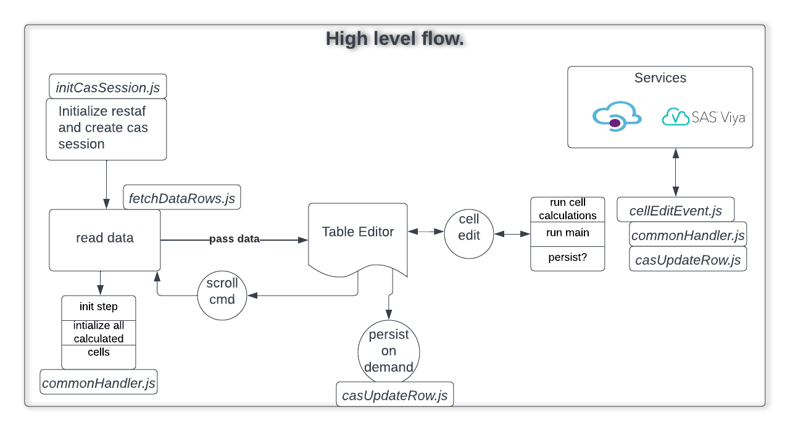

# restafedit - library for browsing and editing CAS tables and SAS Tables

1. [Introduction](#intro)
   - [Link to API documentation](https://sassoftware.github.io/restaf)
2. [Installation](#install)
3. [Basic Flow](#basicflow)
4. [Getting Started Example](#example1)
5. [Editing with calculations](#example2)
6. [First Web Application](#webapp1)
7. [React Application](#reactapp1)
8. [Note on appControl and appEnv](#appcontrol)

---

## Introduction<a name="intro"></a>

---

**Latest Version** @sassoftware/restafedit@next


Going back in history, SAS had products like SAS/FSP and SAS/AF that allowed users to create simple or complex interactive applications. As SAS moved to the Viya platform these products were dropped. SAS provided REST API (application programming interfaces) as an industry standard way for creating applications.

The key component of these applications is entering data. Common destinations of the modified data are:

- The client application
- Custom code on a Viya
  - Compute server
  - CAS (Cloud Analytic Server) server
  - MAS (Micro Analytic Score)
  - Other SAS services that can be accessed via REST API
- Some external servers
  - Azure App running a SAS Decision using SAS Container Runtime (SCR)
  - Others...

The goal of this project is to create a small reusable library to simplify the  data entry in SAS Viya.

## Currently Supported Features<a name="t4"></a>

- Creation and management of CAS session or Compute Session
- Reading one or more records from a cas table or SAS table
- Update the records based on a key
- Scrolling through the table
- Saving the inmemory cas Table
- Allow users to specify calculations on modifying a value. The current options are:
  - On the client using JavaScript
  - On the server
    - On the cas server using casl  or any cas action
    - Using procs and datasteps
- Allow access to all the SAS REST API end points from the handlers.
    - Recommend using [restaf and restaflib](https://sassoftware.github.io/restaf) for rapid appplication development
    - External destination using http (ex: An Azure App for a SAS Decisioning Flow)

---
## Basic Flow<a name="basicflow"></a>

---

The Table Editor in the picture below is supplied by the user.


### Working Examples 

- [Simple Editor Application](https://github.com/sassoftware/restaf-uidemos/blob/editorapp/README.md) - Demonstrates the use of this library using basic javascript and html to edit a cas table.

- [React Application Editing](https://github.com/sassoftware/restaf/blob/restafedit/README.md) - Demonstrates a react application.

---

## Installation<a name="install"></a>

---

The library can be installed using npm, yarn.
It can also be accessed via script tags in your browser.

### Script Tags

restafedit depends on restaf and restaflib

```html
 <script src="https://unpkg.com/@sassoftware/restaf@next"></script>
 <script src="https://unpkg.com/@sassoftware/restaflib@next"></script>
 <script src="https://unpkg.com/@sassoftware/restafedit@next"></script>

 ```

### nodejs

```sh
npm install @sassoftware/restaf@next @sassoftware/restaflib@next @sassoftware/restafedit@next
```

---

## Writing your first editor<a name="example1"></a>

---

### `Scenario 1`

- read data from a cas table
- modify a row and update the inmemory table
- save the inmemory table
- do more scrolling

Link: <https://github.com/sassoftware/restaf/blob/restafedit/test/example1.js>

```js
const { setup, scrollTable, cellEdit, saveTable } = require('../dist/index.js');

runit()
  .then(r => console.log(r))
  .catch(err => console.log(err));


async function runit () {

  // See https://github.com/sassoftware/restaf/wiki/authentication for
  // more details and other options
  const viyaConnection = {
    host        : process.env.VIYA_SERVER,
    authType    : 'password',
    clientID    : 'sas.ec',
    clientSecret: '',
    user        : 'sastest1',
    password    : 'Go4thsas'
  };

  // For readability moved the appControl definition
  // to the end as a function
  // Also a good practice since it allows runtime creation of appControl
  const appControl = getAppControl();

  // setup edit session
  const appEnv = await setup(viyaConnection, appControl);

  // get the first set of records
  // data is available as appEnv.state.data
  // the column definitions are also available as appEnv.state.columns

  let result = await scrollTable('first', appEnv);
  console.log(result.status);
  console.log(appEnv.state.data);

  // Simulate an edit operation
  // The updated record is also updated on the cas inmemory table
  // Uses the byvars in the appControl as the key for merge

  const x3New = result.data[0].x3 + 100;
  await cellEdit('x3', x3New, 0, result.data[0], appEnv);

  // Confirm it was written to the inmemory table
  // by refetching it
  result = await scrollTable('first', appEnv);
  console.log(appEnv.state.data);

  // Optionally persist the imemory table
  const status = await saveTable(appEnv);
  console.log(status);

  // Continue to scroll (next|prev|first) and do more editing
  result = await scrollTable('next', appEnv);
  // Do some more editing
  result = await scrollTable('prev', appEnv);
  return 'done';
};

function getAppControl () {
  return {
    description: 'Simple Example',

    source: 'cas',
    table : { caslib: 'public', name: 'TESTDATA' },
    byvars: ['id'],

    cachePolicy: true,

    initialFetch: {
      qs: {
        start : 0,
        limit : 1,
        format: false,
        where : 'x1 GT 5'
      }
    },

    customColumns: {},

    editControl: {
      handlers: {}, /* place holder for calculations */
      autoSave: true
    },
    appData: {} /* place holder for additional user data  */

  };
}
```

---

## Editing with calculations<a name="example2"></a>

---

### `Scenario 2`

In a typical edit session user input is checked and some temporary(computed/calcuated) columns are updated.

restafedit allows the developer to do these by specifying the information in the appControl.

- Custom Columns -- Specify your additional columns in the CustomColumns field in appControl. There is no limit to the number of calculated columns

- Calculations -- Specify functions in the editControl.handlers object.

Below is the updated example. The custom column is calculated when a record is read and when a cell is modified in the *init* and *main* handlers(functions).

When the column x1 is modified the handler *x1* followed by *main* are executed.

Before the record is written to the server, the *term* handler is executed.

All of these handlers are optional. If you have computed columns then at a minimum you should specify the *init* and *main* handlers. In many cases you can use the same handler for *init* and *main*.

Link: <https://github.com/sassoftware/restaf/blob/restafedit/test/example2.js>

```js
/* eslint-disable quotes */
const { setup, scrollTable, cellEdit, saveTable } = require('../dist/index.js');

runit()
  .then(r => console.log(r))
  .catch(err => console.log(err));

async function runit () {
  const viyaConnection = {
    host        : process.env.VIYA_SERVER,
    authType    : 'password',
    clientID    : 'sas.ec',
    clientSecret: '',
    user        : 'sastest1',
    password    : 'Go4thsas'
  };

  // For readability moved the appControl definition
  // to the end as a function
  // Also a good practice since it allows runtime creation of appControl
  const appControl = getAppControl();

  // setup edit session
  const appEnv = await setup(viyaConnection, appControl);

  // get the first set of records
  // data is available as appEnv.state.data
  // the column definitions are also available as appEnv.state.columns

  let result = await scrollTable('first', appEnv);
  console.log(result.status);
  console.log(appEnv.state.data);

  // Simulate an edit operation
  // The updated record is also updated on the cas inmemory table

  const x3New = result.data[0].x3 + 100;
  await cellEdit('x3', x3New, 0, result.data[0], appEnv);

  // Confirm it was written to the inmemory table
  // by refetching it
  result = await scrollTable('first', appEnv);
  console.log(appEnv.state.data);

  // Optionally persist the imemory table
  const status = await saveTable(appEnv);
  console.log(status);

  // Continue to scroll (next|prev|first) and do more editing
  result = await scrollTable('next', appEnv);
  // Do some more editing
  result = await scrollTable('prev', appEnv);
  return 'done';
};

function getAppControl () {
  return {
    description: 'Simple Example',

    source: 'cas',
    table : { caslib: 'public', name: 'TESTDATA' },
    byvars: ['id'],

    cachePolicy: true,

    initialFetch: {
      qs: {
        start : 0,
        limit : 1,
        format: false,
        where : 'x1 GT 5'
      }
    },
    customColumns: {
      total: {
        Column         : 'Total',
        Label          : 'Grand Total',
        FormattedLength: 12,
        Type           : 'double'
      }
    },

    editControl: {
      handlers: { init, main, term, x1 }
    },
    appData: {} /* place holder for additional user data  */

  };
}
async function init (data, rowIndex, appEnv, type) {
  let status = { statusCode: 0, msg: `${type} processing completed` };
  data.total = data.x1 + data.x2 + data.x3;
  debugger;
  return [data, status];
};
async function main (data, rowIndex, appEnv, type) {
  let status = { statusCode: 0, msg: `${type} processing completed` };
  data.total = data.x1 + data.x2 + data.x3;
  debugger;
  return [data, status];
};

async function term (data, rowIndex, appEnv, type) {
  let status = { statusCode: 0, msg: `${type} processing completed` };
  console.log('In term');
  debugger;
  return [data, status];
};

async function x1 (data, name, rowIndex, appEnv) {
  let status = { statusCode: 0, msg: `${name} handler executed.` };
  if (data.x1 > 10) {
    status = { statusCode: 1, msg: `Value of X1 exceeded 10. Set to 10` };
  }
  return [data, status];
};

```

---

## First Web Application<a name="webapp1"></a>

---

### `Scenario 3`

In this scenario, the goal is to create  very simple web application that mimics Scenario 2.
Note that the application code is very similar to Example 2, with the obvious additional coding in the html file for display.
The simple display is shown below. The html for this display is [here](https://github.com/sassoftware/restaf-uidemos/blob/editorapp/public/index.html).


The code to handle the initialization, cellediting and scrolling is the code below. Notice the similarity with the Example 2 Scenario aboe.
The key differences are:

- The authtentication(viyaConnection) uses authorization_code flow.
- The initialize function is executed after DOM initialization.

The html

```js

// web app version of Example 2
// Main difference is the initialize function to do the initialization
// when the body is initialized
//
function getAppControl() {
  return {
    description: 'Simple Example',
    source: 'cas',
    table : {caslib: 'public', name: 'TESTDATA'},
    byvars: ['id'],
    initialFetch: {
      qs: {
        start : 0,
        limit : 1,
        format: false,
        where :  ''
      }
    },
    customColumns: {
      total: {
        Column         : "Total",
        Label          : "Grand Total",
        FormattedLength: 12,
        Type           : "double"
        }
    },
    editControl: {
      handlers: {init: init, main: main, term: term, x1: x1},
      autoSave: true, 
  
    },
    appData: {}

  };
};

async function initialize(viyaConnection) {
  // In this example the browser ia authenticated
  // So the viyaConnection has the following schema
  // { host: <viyahostURL, authType: 'code'}
  debugger;
  let appControl = getAppControl();
  let r = await restafedit.setup(viyaConnection, appControl);
  let r2 = await restafedit.scrollTable('first', r);
  return r;
  }
async function init (data,rowIndex,appEnv,type) {
  let status = {code: 0, msg: `${type} processing completed`};
  data.total = data.x1 + data.x2 + data.x3 ;
  return [data, status];
};
async function main (data, rowIndex,appEnv, type) {
let status = {code: 0, msg: `${type} processing completed`};
data.total = data.x1 + data.x2 + data.x3 ;
return [data, status];
};
async function term (data, rowIndex,appEnv, type) {
  let status = {code: 0, msg: `${type} processing completed`};
  return [data, status];
};

async function x1 (data, name, rowIndex, appEnv) {
  let status = {code: 1, msg: `${name} handler executed.`};
  if (data.x1 > 10) {
      data.x1 = 10;
      msg = {code: 0, msg: "Exceeded Max. Value reset to max"};
  }
  return [data, status];
}

```

## [React Application]<a name="reactapp1"></a>

### `Scenario 4`

In this scenario the web application in scenario 3 is converted to a react application. 
The working example is in this [repository](https://github.com/sassoftware/restaf-uidemos/tree/editorappreact)

<blockquote>
The example uses material-ui as the component library.
The restafedit library is component library agnostic.
</blockquote>

Ignoring the react specific setups, the editing application setup is very similar to the previous scenarios. The appControl is extracted here for convenience. 

#### A note on appData

This is optional. It can be used by the application writer to setup additional configurations.
In this example this is used to customize the UI. This can be safely ignored at this point since it is application specific.

```js
// web app version of Example 3
// Main difference is the initialize function to do the initialization
// when the body is initialized
//

async function init (data, rowIndex, appEnv, type) {
  data.total = data.x1 + data.x2 + data.x3 ;
  return [data, { code: 0, msg: `${type} processing completed` }];
};
async function main (data, rowIndex, appEnv, type) {
  data.total = data.x1 + data.x2 + data.x3 ;
  return [data, { code: 0, msg: `${type} processing completed` }];;
};
async function term (data, rowIndex, appEnv, type) {
  return [data, { code: 0, msg: `${type} processing completed` }];
};

async function x1 (data, name, rowIndex, appEnv) {
  let status = { code: 1, msg: `${name} handler executed.` };
  if (data.x1 > 10) {
    data.x1 = 10;
    status = { code: 0, msg: 'Exceeded Max. Value reset to max' };
  }
  return [data, status];
};

// eslint-disable-next-line no-unused-vars
function getAppControl () {
  return {
    description: 'Simple Example',

    source: 'cas',
    table : { caslib: 'public', name: 'TESTDATA' },
    byvars: ['id'],

    initialFetch: {
      qs: {
        start : 0,
        limit : 10,
        format: false,
        where : ''
      }
    },
    customColumns: {
      total: {
        Column         : 'Total',
        Label          : 'Grand Total',
        FormattedLength: 12,
        Type           : 'double'
      }
    },
    editControl: {
      // eslint-disable-next-line object-shorthand
      handlers: { init, main: main, term: term, x1: x1 },
      autoSave: true
    },
    appData: {
      viewType: 'table', /* table|form */
      form: {
        defaultComponent: 'InputEntry',
        show            : ['id', 'x1', 'x2', 'x3', 'total'],
        classes         : {},
        title           : 'Editing Data with React Components',
        visuals         : {
          total: {
            props: {
              disabled: true
            }
          },
          id: {
            props: {
              disabled: true,
            }
          }
        }
      }
    }
  };
}

```

#### Table versus form editing

This particular application is designed to either a table or a form for editing.

There are significant differences in how the user interacts with an application which uses a Table versus a custom form in an UI.

However, at the lowest level both require the same functionality - Accessing data, verifying the entered data, saving the modified records, executing additional processing on the server.

One of the key goals of this project is to create a single code base to handle both scenarios.

### Notes on the application

The main entry into the application is shown below. If you are familiar with react programming please see the [repository](https://github.com/sassoftware/restaf-uidemos/tree/editorappreact) for details.

The main thing to note here is that a DataEditor component is being called.
The appControl and viyaConnection information is passed to it.
This particular implementation allows the app to switch between table editing and form editing.

```jsx

import React, { Fragment } from 'react';
import DataEditor from './DataEditor';
import TableEditor from './TableEditor';
import DataForm from './DataForm';
import Grid from '@material-ui/core/Grid';

function ViyaDataEditor (props) {
  
  const _selectViewer = () => {
    return (props.appControl.appData.viewType === 'table') ? TableEditor : DataForm;
  };
  
  const show = (
    <Fragment>
    <div key={Date()}>
      <Grid container spacing={3} direction="row">
          <Grid item>
            <DataEditor key={Date()}
                  appControl={props.appControl}
                  viyaConnection={props.viyaConnection}
                  editor={_selectViewer}
                  />
          </Grid>
        </Grid>
    </div>
    </Fragment>
  );
  
  return show;
}
export default ViyaDataEditor;
```

Below is image of the application for form editing and table editing.


---

## Notes on appControl<a name="appcontrol"></a>

---

// AppControl with sample data

```js
function getAppControl () {
  return {
    description: 'Simple Example',
    source: 'compute', /* set to cas if data is in cas */
    table : { libref: 'TEST', name: 'TESTDATA' },  /* change libref to caslib if using cas */
    byvars: ['key'],
    cachePolicy: true, /* default is true */
    initialFetch: {
      qs: {
        start: 0,
        limit: 1,
        format: false,
        where: '' 
    },
    customColumns: {},
    editControl: {
      handlers: {}
      autoSave: true  /* save to server after every edit. For cas, it updates inmemory table */
    },
    computeContext: null, /* optional - defaults to Job Execution Service */
    appData: {}

  };
}
```


### Usage

The appControl is an argument to the setup function..

```js

let appEnv = await setup(logonPayload, appControl)

```

- logonPayload - used to establish connection with Viya and create cas session.

- appControl - Information needed to control the session.

- appEnv - this is the control object for the edit session

### Notes on AppControl

Use this argument to setup the edit session. AppControl has the following schema with some sample values.

```js
  {

      source: 'cas', /* cas | compute */
      table : {caslib: 'casuser', name: 'testdata'},/* for compute: {libref: xxx , name: yyy}
      byvars: ['id'], /* used a key when updating records. */
      cachePolicy: true, /* data will be managed for you. */

      initialFetch: { /* what to read on initialization */
        count : 1, /* number of records read on each fetch */
        from  : 1, /* record to start the read from */
        format: false  /* return formatted or unformatted results */
      },

      customColumns: {  /* custom columns for use during the session */
         total: { /* sample */
         Column         : "Total",
         Label          : "Grand Total",
         FormattedLength: 12,
         Type           : "double"
      }
    },
   editControl: {
     handlers  : {}, /* handlers for init, main, term and columns. See below */
     autoSave  : true /* celledit will save to server on each edit*/
   },
   appData: {} /* place for user specified information
 }
   
```

- source:  (cas|compute) - The data is a cas table or SAS V9 table.
- initialFetch:  the first set of records to read
  - from: The record number where the read starts(table.fetch action(not an offset)
  - count: Number of records to read. On every fetch this many records will be read.

- cachePolicy: If true the data is stored in appEnv.state. You should set this to false if you want to manage the data. The pagination information will always be saved in appEnv to enable easy scrolling. The initial set of records wille be persisted in appEnv(see below).
- handlers:  This is an object with functions for init, main, term and indiviual columns. Set to {} if you do not plan to make use of this feature. Use the handlers that make sense to you. See below for the samples
- byvars: An array of by variables. At this time, one has to use this as key to update a record in CAS. ex: ['firstname', 'lastname']
- customColumns: You can add additional columns(temporary) to be used during the session. These columns are not persisted to the server. These variables are available to the handlers. A typical example might be to display some row totals. If none, set this value to {}
- editControl: This object specifies the handlers for INIT, MAIN and TERM. Also specify the handlers for individual columns. All of these are optiona. See example below.

- appData - this is where the  app writer can save information and retrieve it from appEnv. appEnv is passed to all handlers. So it is available in functions like init, main etc. The example above shows what I use in my generic DataEditor component

### appEnv

This object houses all the information needed access Viya, edit handlers, etc...
It also has a place for application writers to save application specific information.

The schema is below with sample values. While the library only supports cas server at this point, the plan is to add support for compute service.

appEnv is passed to all user defined handlers and functions in this library. Makes for a more flexible programming.

Do not change any of the values in this object. Use appControl object to store/read your information.

```js
{
    store       : <this is the control object for restaf library>,
    session     : <cas session object or compute session>
    restaflib   : <object to access functions in restaflib>,
    logonPayload: <information to connect to Viya -see below>,
    appControl  : appControl /* passed in by user to setup -see below */
    state       : {
       modified   : [], /* future - keep track of modified rows */
       pagination : {}, /* internal use to help with pagination */
       data       : {}, /* array of currrent rowObjects(see below) */
       columns    : {}  /* columns in eschema form (see below) */
    }
}
    
```

### Notes on appEnv

This is designed to make it convenient to track all relevant information by the library and the user of the library.

- **store** This is created by [restaf](https://sassoftware.github.io/restaf/module-runAction.html) library that makes the final calls to Viya REST APIs. The methods in restafedit makes use of restaf.

- **session** This is the current cas session or compute session. It is stored here to allow users to run additional actions in the same session.

- **restaflib** Use this to make calls to [restaflib](https://sassoftware.github.io/restaf/module-runAction.html) methods.

- **logonPayload**  This is used connect to Viya. Passed in by user to setup. See below for more information

- **appControl** This is the information passed in by the user to setup. See below

- **state** This holds the data retrieved from the server. You can override this behaviour with the cachePolicy(see below). Feel free to cache the data in other ways, especially if you want this source of truth to be available in other parts of your application. See below for details on state.

## Details on state

### data

state.data is an array of rowObjects. A rowObject has the form

```js

{x1: 20, x2: 'abc',....}


```

The keys are lower-cased column names.

If you added computed columns they will also be in this object. This allows the custom handlers like init, main and term to access these.

When updating the data on the server, the custom columns are dropped.

### Columns

The schema returned from the server is reduced to this form(eschema) and enhanced with information on custom columns.

```js
{x1: {schema for x1}, x2: {schema for x2},...}
```

An extra key 'custom" is added to each of the details. This is set to "true" if the column is a custom column.

This additional key is useful

- Save operations can drop these columns
- Can be used by UI to apply a different style to custom columns

### byvars

At the current time, we have to use key columns to identify the row to be updated. So byVars is an array of the key fields.

ex: ['X1', 'X2']

---

#### Notes on logonPayload

The logonPayload is designed to handle many situations. See this [link](<https://github.com/sassoftware/restaf/wiki/authentication>) for all the options.

Some common cases are described below

#### Authenticated browser

If the browser is authenticated(authorization_code flow) then the following is recommend

```js
{ host: <url for your Viya server>}
```

If you use the authentication token, then use the following:

```js
{ 
    host: <url for your Viya server>,
    token: <your authentication token>
}
```

### **cellEdit - Handles changes to a specific cell**

A cell is defined a the intersection of a column and a data row. The cellEdit does the following:

- If the column has an handler it will be called.
- If 'main" handler is specified, it will be called.
- If autoSave is true
  - The 'term' handler(if specified) will be called
  - The data for that row will be persisted to the server

```js
  let r = await cellEdit(columnName,value, rowIndex, currentRow, appEnv);
```

The function returns the following:

```js

{ data: <the updated data>,
  status: {statusCode: 0|1|2, msg: <some string>

}
```

### **scrollTable - scroll either to prev or next set of records**

```js
 let r = await scrollTable(direction, appEnv, payload);
```

- direction  A string with the value of 'first', 'next', 'prev'

To do custom scrolling, use the optional payload argument.
For example to apply a where clause, you can use the following:

```js
let payload = {
  from: 1,
  count:20,
  format: false,
  where: 'x1 GT 10'
}
```

For SAS tables the payload can include any of the values as described [here](https://developer.sas.com/apis/rest/Compute/#get-a-row-set-from-a-data-set)
The result has the following schema

```js
{
  data: <array of data rows>,
  columns: <object with enhanced column information>
}

```

If the cachePolicy is set to true, appEnv.state has this information also and you do not have to persist the results.

> For SAS tables (from - 1) is used as the offset. See compute service document for notes on this.

## Sample handlers

### init, main and term handlers

A sample code is below. init, main and term all have the similar pattern

The handlers for columns has an additional argument - the name of the column.

- data - the current row
- row  - rowIndex
- type - init|main}|term}|name of the column

```js

async function init (data,row,appEnv,type) {
    let status = {statusCode: 0, msg: `${type} processing completed`};
    data.total = data.x1 + data.x2 + data.x3 ;
    return [data, status];
};

async function x1 (data, name, row, appEnv) {

  let msg = {code: 0, msg: `${name} handler executed.`};
  if (data.x1 > 10) {
      data.x1 = 10;
      msg = {statusCode: 1, msg: "Exceeded Max. Value reset to max"};
  }

  return [data, msg];
};

```

### Accessing Viya from the handlers

The appEnv has the necessary information to access SAS Viya and in particular the cas session used by the edit session.

Note that you can use restaf and restaflib in the handlers(with store) to access any Viya REST API. You are not restricted to the current cas session.

The example below doing some calculations on the cas server

```js

import calculate from './calculate.js';
async function main (data, _rowIndex, appEnv,_type) {
    let {store, restaflib, session} = appEnv;
    let status = {code: 0 , msg: "Main processing completed"};

    // create casl statements
    let code = `
        send_response({total= _args_.x1 + _args_.x2 + _args_.x3});
    `;

    // run the code and return results - data is tranformed to _args_ by caslRun

    let r = await restaflib.caslRun(store, session, code, data);
    data.total = r.results.total;

    return [data, status];
};
export default main;

