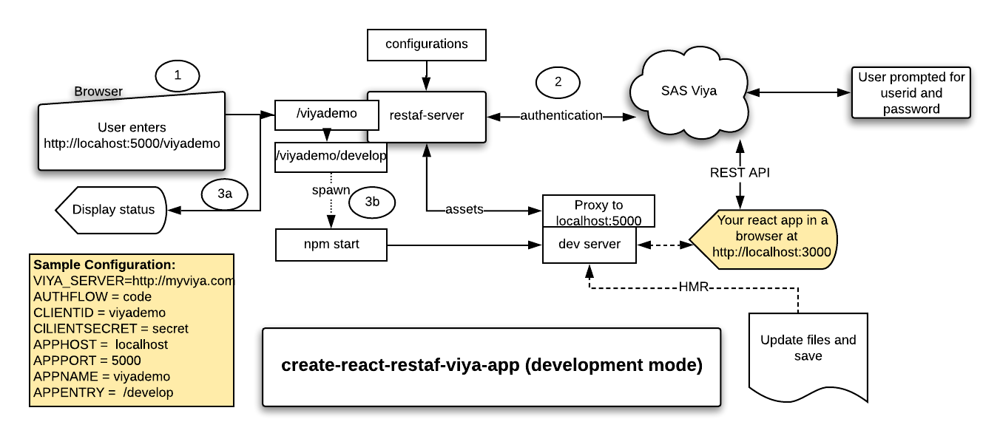

# create-react-restaf-viya-app

[create-react-app](https://create-react-app.dev/) is a very popular cli to jump start the development of react-based applications.

create-react-restaf-viya-app is an extension of create-react-app. The target audience is react developers building SAS Viya Apps.

1. [restaf](https://github.com/sassoftware/restaf/wiki)

2. [restaflib](https://github.com/sassoftware/restaf/wiki)

3. [restaf-server](https://github.com/sassoftware/restaf-server/wiki)

## Benefits

Some of the benefits of using this cli to jump start your SAS Viya Applications

1. You retain all the benefits of using create-react-app which are well documented

2. You are automatically authenticated to the Viya Server.

3. You can start making API calls right away during development just as you would in production.

## A note on making API calls

The recommended way is to use restaf and restaflib to make the REST API calls. See the sample application created on your first creation of the application.

If for some reason[*the author can think of none*] you would prefer to hand-code the calls you can do that too. Remember that the session is authenticated using authorization_code flow and code appropriately.

---

## Creating your react application

---

Issue the command below to create the default application.

```sh
npx create-react-restaf-viya-app react-appname --webapp webapp-name  --title webapp-title --script scriptTags-file

```

```sh
Example:
npx create-react-restaf-viya-app mycoolapp
```

Only the react-appname is required. The optional parameters are:

- webapp  -- this is the user-friendly application name. Defaults to **viyademo**

- title   -- The text for the title tag in index.html. Defaults to **SAS/Viya Application**

- script  -- a file which has some HTML script tags to be inserted into index.html - defaults is a comment line

---

## Using the Generated Application

---

Once the app has been created you can start your development.

## Key Assumption

The application is authenticated using authorization_code flow.

## Configuration

Set the following in the .env file:

- CLIENTID  -- the default value is viyademo
- CLIENTSECRET -- the default value is secret
- VIYA_SERVER  -- no defaults.You must specify this(ex: <http://myviya.com>)

### Some defaults

1. The app server runs on localhost:5000/viyademo
2. The clientid redirect is <http://localhost:5000/viyademo>
3. The create-react-app server runs on its standard port(3000)

For more detailed configuration options see
See <https://github.com/sassoftware/restaf-server/wiki>

## App Development

1. Modify App.js to suit your needs
2. Install any additional packages your app might need.

## Running in Development Mode

Run this command to have HMR enabled

```sh
cd to-the-app-directory
yarn dev
```

The flow of the application on the yarn dev command is show below.

- Step 1   :  User invokes the application at <http://localhost:5000/viyademo>

- Step 2: restaf-server authenticates with the Viya Server. The user is prompted for credentials

- Step 3a: Status of the initialization is displayed in the browser.

- Step 3b: restaf-server runs the create-react-app's **npm start** script which launches your react application in a second tab of your browser.

At this point you can view your application, edit your code and see the updated application. The session is authenticated -so you can make REST API calls to SAS Viya using restaf or any other library.



## Running in Application mode

Run this command. Note that the create-react-app dev server will not started.

```sh
cd to-the-app-directory
yarn build
yarn app
```

## React Context - AppContext

By default a react context named AppContext is created.

To access the data code something like this:

```js

import React,{useContext} from 'react';
import {AppContext} from '../providers';

let appContext = useContext(AppContext);

let {store, appOptions} = appContext;

let {appenv, logonPayload} = appOptions;

```

The store is the restaf store object that you will use to make the API calls.

The logonPayload will have the following form:

```js
{
    authType: 'server'
    host    : "your Viya hostname"
}
```

The host value is useful if you are making use of VA_SDK and/or if you are coding the REST API calls without restaf.

## Requiring restaf and restaflib in your application

These two libraries are part of the installed dependencies. To access them in your react components do these as follows:

```js
let restaf = require('@sassoftware/restaf/dist/restaf.js');
let restaflib = require('@sassoftware/restaflib/dist/restaflib.js');

or

import * as restaf from '@sassoftware/restaf/dist/restaf.js';
import * as restaflib from '@sassoftware/restaf/dist/restaflib.js';

```

In all probablity you will not refer directly to restaf in your code. You will use the store object in the AppContext(see above). This value is set as part of the application startup.
