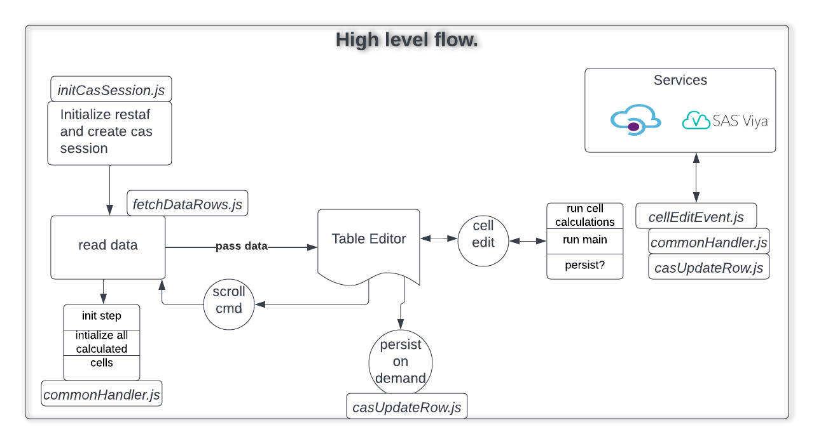

[FSP on Viya	1](#_Toc583745382)

[Introduction	1](#_Toc805632312)

[A note on multi-user environments	1](#_Toc731399551)

[Desired features in the work product	2](#_Toc562931818)

[Demo Application	2](#_Toc413439152)

[Currently Supported Features of the library	2](#_Toc1664768901)

[Basic Flow	4](#_Toc1528817640)

[Future	5](#_Toc538713069)

#

# FSP on Viya

## Introduction

Going back in history, SAS had products like SAS/FSP and SAS/AF that allowed users to create simple or complex interactive applications. As SAS moved to the Viya platform these products were dropped. SAS provided REST API (application programming interfaces) as an industry standard way for creating applications.

The key component of these applications is entering data. Common destinations of the modified data ARE:

- The client application
- Custom code on a Viya
  - Compute server
  - CAS (Cloud Analytic Server) server
  - MAS (Micro Analytic Score)
  - Other SAS services that can be accessed via REST API
- Some external servers 
  - Azure App running a SAS Decision using SAS Container Runtime (SCR)
  - Others...

## Desired features in the work product

The goal of this project is to create a small reusable library and components for data entry in SAS Viya. 

This collection should have the following characteristics:

1. Must be useable out of the box by users (internal and external)

2. Must address the basic capabilities of SAS/FSP and SAS/AF since these represent the requirements of SAS users over an extended period.

3. The core functionality must be unaware of the UI (User Interface) environment it is running in. The assumption is that the UI capability will be supplied by SAS and/or users.

4. React components (must be limited and serve as examples) must be agnostic of specific React Component libraries (ex: Nova, material-ui and others).

5. Must be extendible to address the considerable number of requirements gathered by Product Management.

## Table versus Form for data entry

There are significant differences in how the user interacts with an application which uses a Table versus a custom form.

However, at the lowest level both require the same functionality - Accessing data, verifying the entered data, saving the modified records, executing additional processing on the server.

One of the key goals of this project is to create a single code base to handle both scenarios.
[TBD: Detailed document on the library functions and usage notes].

## Demo Application

The data-editor demo application will be available soon.

## Currently Supported Features of the library

- Creation and management of CAS session

- Reading one or more records from a cas table

- Update the records based on a key

- Scrolling through the table

- Allow users to specify calculations on modifying a value. The current options are:
  - On the client using JavaScript
  - On the cas server using casl or any cas action
  - On an external server via http
  - An Azure App for a SAS Decisioning Flow

## Basic Flow

The Table Editor in the picture below is supplied by the user.

## Future

- Support where clause for reading records

- Editing with standard SAS tables

- Examples of using non-SAS databases like SingleStore(?)
